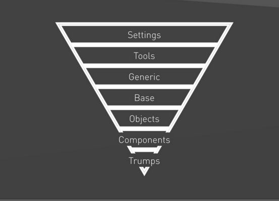

# CSS Standard

This standard uses two main methodologies BEM and ITCSS, so if you don't know much avoid there is some good documentation on [CSS material](awesome-list.md)

## Syntax and Formatting

[Prettier!!!](https://prettier.io/docs/en/index.html)

### Constants

- Always use the constant instead of the hex value when using colors

### Comments

- As a rule, you should comment on anything that isn’t immediately obvious from the code alone. That is to say, there is no need to tell someone that color: red; will make something red, but if you’re using overflow: hidden; to clear floats—as opposed to clipping an element’s overflow—this is probably something worth documenting.
- The preprocessor should remove all the comments for PROD environments.

#### Component or section

Add comment for each component:

- Description: explaining its purpose
- How to use it
- Examples

```css
/**
* Text inputs
*
* Instead of a `[type]` selector for each kind of form input, we just use a
* class to target any/every one, e.g.:
* <input type=text class=TextInput>
* <input type=email class=TextInput>
* <input type=password class=TextInput>
*
*/
```

#### Sass mixins

Add a comment with:

- Description: explain the purpose of the mixin
- How to use it
- Parameters information, similar to jsDocs
- Examples

```css
/**
* Create vendor-prefixed CSS in one go.
* @param $property - a css property
* @param $value - the property value
* 
* Example: 
* @include vendor(border-radius, 4px);
*
*/
@mixin vendor($property, $value...) {
  -webkit-#{$property}: $value;
  -moz-#{$property}: $value;
  -ms-#{$property}: $value;
  -o-#{$property}: $value;
  #{$property}: $value;
}
```

## Naming Convention

### Ids

Use camelCase for id names:

```html
<div id="editableForm"></div>
```

### BEM

We based our naming convention on BEM (Block, Element, Modifier).

If you are not familiarized with BEM please check all these documentation: [CSS material](awesome-list.md)

- **Block:** The main or root tag of the HTML structure.
- **Element:** A section or element part of the Block. Those are delimited with two (2) **underscores (\_\_)**,
- **Modifier:** A variant or extension of the Block or element. Those are delimited by two (2) **hyphens(--)**.

```css
// Block component //

.Person
    ...

// Element that depends upon the block //

.Person__head
    ...

// Modifier that changes the style of the block //

.Person--tall
    ...;
```

**IMPORTART!**

If we were to add another Element—called, let’s say:
`.Person__eye {}` to `.Person`, The correct notation would be `.person__eye {}`, and not `.PersonHead__eye {}`. **Your classes do not reflect the full paper-trail of the DOM.**

### Syntax

```css
[<namespace>-]<ComponentName>[__descendentName][--modifierName]
```

#### ComponentName

The component's name must be written in PascalCase.

```html
.MyComponent { /* … */ }

<article class="MyComponent">…</article>
```

#### ComponentName--modifierName

A component modifier is a class that modifies the presentation of the base component in some form

```html
/* Core button */ .Button { /* … */ } /* Default button style */
.Button--default { /* … */ }

<button class="Button  Button--default" type="button">…</button>
```

#### ComponentName\_\_descendantName

The descendent name must be written in camelCase.

A component descendant is a class that is attached to a descendant node of a component. It's responsible for applying presentation directly to the descendent on behalf of a particular component. Descendant names must be written in camel case.

**Important: an element cannot have nested elements.**

```html
<article class="Tweet">
  <header class="Tweet__header">
    
    …
  </header>
  <div class="Tweet__bodyText">…</div>
</article>
```

#### ComponentName.is-stateOfComponent

Use is-stateName to reflect changes to a component's state. The state name must be camel case. Never style these classes directly; they should always be used as an adjoining class.

This means that the same state names can be used in multiple contexts, **but every component must define its own styles for the state** (as they are scoped to the component).

```html
.Menu { /* … */ } .Menu.is-expanded { /* … */ }

<article class="Menu is-expanded">…</article>
```

### Namespaces

If necessary, components can be prefixed with a namespace. For example, you may wish to avoid the potential for collisions between libraries and your custom components by prefixing all your components with a namespace.

```css
.twt-Button {
  /* … */
}

.twt-Tabs {
  /* … */
}
```

When reading the HTML this makes clear which components are part of your library.

### Insertion Points

Insertion points for legacy javascript or widgets should be prefixed with the "ip" namespace. For example.

```css
.ip-button .ip-tango .ip-morseMenu;
```

### Utilities

Low-level structural and positional traits. Utilities can be applied directly to any element within a component.

Syntax: **u-[sm-|md-|lg-]<utilityName>**

Example: **u-utilityName**

Utilities must use a camelCase name. What follows is an example of how various utilities can be used to create a simple structure within a component.

```html
<div class="u-cf">
  <a class="u-floatLeft" href="{{url}}">
    
  </a>
  <p class="u-sizeFill u-textBreak">…</p>
</div>
```

#### Best Practices

- Imagine that we have the following HTML structure:

```html
<div class="Person u-floatLeft">....</div>
```

It is more difficult to debug or to mantain the CSS when several classes are applied to the same HTML element.

When you are bulding a new component and a HTML element already has a BEM class (you just created), it is **preferable** to add the value of the utility class to the BEM CSS rule:

```html
<div class="Person">....</div>

<!-- CSS -->
.Person { .... float: left ... }
```

If the utility is an special case that cannot be applied to all the elements that use the BEM CSS rule, you can replace it with a modifier.

```html
<div class="Person Person--alignLeft">....</div>

<!-- CSS -->
.Person { .... &--alignLeft { float: left } ... }
```

**This is preferable but is not required**, it does not apply to all the cases, it is preferable when creating new components, if you are just adding an utility to a element you can consider this best practice, but is not required.

### Responsive utilities

### Manipulating CSS classes with Javascript utility

When you have to access or manipulate an element via Javascript, you must add an utility class to the HTML with the fomat: js-camelCase, example:

```html
<div>
    ....
    <button class="js-actionButton">
    ....
</div>
```

### SASS naming convention

Given that the naming convention of CSS properties is kebab-case; we should stick with it in order to achieve a standard naming convention for all the .scss files. This includes the naming of mixins, placeholders, variables, and files.

```html
$foo-bar: 3px; %my-placeholder-example { // ... } @mixin
my-mixin-example($my-argument) { @extend %my-placeholder-example; height:
$my-argument; weight: $foo-bar; // ... }
```

### Classes order

You must follow this pattern when adding classes to an element:

**ParentsClasses ElementClasses u-utilities js-utilities**

```html
<div class="SignUp">
  <form class="SignUp__form Form" method="post">
    <div class="Form__header">
      <h1>{{title}}</h1>
      
      <h3 class="Form__description u-body1 u-textCenter" data-theme="light">
        {{description}}
      </h3>
    </div>
    <div
      class="Form__field Form__field--signup ip-emailField"
      data-theme="light"
    />
    <button
      class="SignUp__button Button Button--circular u-textCenter js-nextButton"
    >
      {{nextLabel}}
    </button>
  </form>
  <div class="ip-keyboardActions"></div>
</div>
```

Notice the img tag:

```html


```

## CSS Selectors

Considerations when writing selectors

### Selector Intent

For several reasons like Portability, Maintainability and performance **ALWAYS** use class instead of HTML tags

No:

```css
header ul
```

Yes:

```css
.siteNav
```

### Nesting

**DO NOT USE NESTING!!!**

Avoid really hard the use of nesting, use only on special cases like this [one](http://cssguidelin.es/#modifying-elements), read the modifying-elements section, the interesting part is at the end

### Sass

- Never nest rules purely for code organization. Only nest when the outputted CSS is what you want.
- Never use a mixin if you’re not passing an argument. Mixins without arguments are much better used as templates which can be extended.
- Never use @extend on a selector that isn’t a single class. It doesn’t make sense from a design perspective and it bloats the compiled CSS.
- Never use @extend for UI components in component modifier rules because you lose the inheritance chain More About [this](http://philipwalton.com/articles/css-architecture/#preprocessors)

### Specificity

1. Don't use ID in your CSS selectors
2. Not nesting selectors
3. Do not use HTML tags in the selectors

**!important:**

1. Should only be used as a helper or utility.
2. Only use !important proactively, not reactive.

### Portability

Reducing, or, ideally, removing, location dependence means that we can move components around our markup more freely,

```css
input.btn {
}
```

This is a qualified selector; the leading input ties this ruleset to only being able to work on input elements

### Location Independence

Our components’ styling should not be reliant upon where we place them—they should remain entirely location independent.

Let’s take an example of a call-to-action button that we have chosen to style via the following selector:

```css
.promo a {
}
```

Not only does this have poor Selector Intent—it will greedily style any and every link inside of a .promo to look like a button—it is also pretty wasteful as a result of being so locationally dependent: we can’t reuse that button with its correct styling outside of .promo because it is explicitly tied to that location. A far better selector would have been:

```css
.btn {
}
```

### Performance

MUST check these [short videos](https://www.youtube.com/watch?v=-CATiyw2-Ns&index=17&list=PLAwxTw4SYaPmKmNX-INgcxQWf30KuWa_A) (5 min in total)

The longer a selector is (i.e. the more component parts) the slower it is, for example:

```css
body.home div.header ul {
}
```

…is a far less efficient selector than:

```css
.primary-nav {
}
```

More [about it](http://cssguidelin.es/#selector-performance)

## CSS Architecture

### ITCSS (Inverted Triangle CSS)

Is a new methodology. It involves visualizing your entire CSS project as a layered, upside-down triangle. This hierarchical shape represents a model that will help you order your CSS in the most effective, least wasteful way.

- Generic to explicit
- Far-reaching to localized
- Low specificity to High specificity

#### Layers:



- SETTINGS: Global Variables, config switches, brand colours
- TOOLS: Global available tools, Default mixins and helpers functions
- GENERIC: Ground-zero styles like normalize, resets, box-sizing, low specificity
- BASE: Unclassed HTML elements (H1-H6, lists, links, etc), last layer we see type selectors(html tags)
- OBJECTS: Cosmetic-free design patterns. like uiList, wrapper
- COMPONENTS: Designed components, chunks of ui, like ProductList
- TRUMPS: Helpers and overrides, usually use !important

For creating a reverse -triangle layer structure in which, we organize our files from the most general elements, to the most specific elements.

If you want to know more about ITCSS, [please check this documentation](/sections/frontend/awesome-list.md)

#### Project Structure

```css
    - css
     |__ _settings
          |__  _colors.scss
          |__  _fonts.scss
          |__  _icons.scss
          |__  main.scss

     |__ _tools
          |__ _functions.scss
          |__ _mixins.scss
          |__  main.scss

     |__ _generic
          |__  _box-sizing.scss
          |__  _normalize.scss
          |__  main.scss

     |__ _base
          |__  main.scss

     |__ _objects
          |__ _grid.scss
          |__ _wrappers.scss
          |__  main.scss

     |__ _components
          |__ _button.scss
          |__ _carousel.scss
          |__ _tab.scss
          |__ _application/
                  |__ _login.scss
                  |__ _terms.scss
                  |__ main.scss
          |__  main.scss

     |__ _trumps
          |__  _variables.scss
          |__  main.scss
     main.scss
```

**Main sass file**

```css
/* Settings */
@import '_settings/main'; /*Global Variables, config switches.*/

/* Tools */
@import '_tools/main'; /*Default mixin and functions*/

/* Generic */
@import '_generic/main'; /* Ground-zero styles (normalize, resets,box-sizing)*/

/* Base */
@import '_base/main'; /* Unclassed HTML elements (type selectors).*/

/*Objects*/
@import '_objects/main'; /* Cosmetic-free design patterns */

/* Components */
@import '_components/main'; /*Designed components, chunks of ui*/

/*Trumps*/
@import '_trumps/main'; /* Helpers and overrides*/
```

## Best practices

### BEM

On our daily basis mostly what we do it's to create components that's why this documentation is focused on building components but BEM naming convention was made for Web Development, not only for web components.

Best practices:

- Our classes do not reflect the full tree structure of the DOM, you don't need to add classes to each HTML tag.

- A component is not limited to have only one Block section, it may have multiple BEM block sections, for example, imagine that we have the Page that lists personal information about patients:

      	```
      	<!-- Example: One Block element per component -->
      		<section class="Page">
      			<div class="Page__emptyState">
      				<avatar class="Page__emptyStateAvatar"></avatar>
      				<avatar class="Page__emptyStateCaption"></avatar>
      			<div>
      			<ul class="Page__content">
      				<li class="Page__contentItem">
      					<avatar class="Page__contentItemAvatar"></avatar>
      				</li>
      				<li class="Page__contentItem">
      					<avatar class="Page__contentItemAvatar"></avatar>
      				</li>
      			<ul>
      		</div>
      	```

As you may notice the class names are long and a little bit messy, this happens because BEM does not support Elements inside Elements, only the Block can have Elements. In this case, we created long class names to specify the Element name under the entire Block structure.

There are two ways to fix it:

1.                 Create new components to encapsulate some sections, for example, create a component that encapsulates the Page_contentItem functionality. ``Page__contentItem`` => ``ContentItem``
2.  Create multiple Block sections, for example:

```
	<!-- Example: Multiple Block element per component -->
		<section class="Page">
			<div class="EmptyState">
				<avatar class="EmptyState__avatar"></avatar>
				<avatar class="EmptyState__caption"></avatar>
			<div>
			<div class="Page__content">
				<ul class="PersonalInfo">
					<li class="PersonalInfo__item">
						<avatar class="PersonalInfo__avatar"></avatar>
					</li>
					<li class="PersonalInfo__item">
						<avatar class="PersonalInfo__avatar"></avatar>
					</li>
				<ul>
			</div>
		</div>
```

## References

This standard is base on several articles and best practices:

- http://cssguidelin.es/
- https://github.com/suitcss/suit
- https://github.com/inuitcss/getting-started
